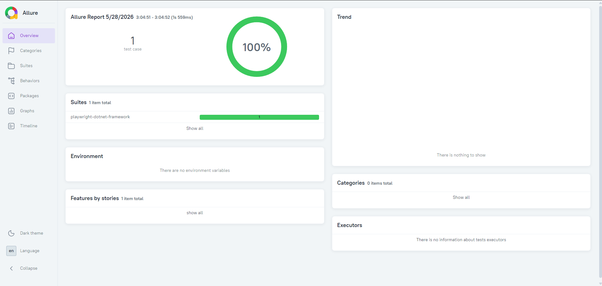

# Framework de Automação de Testes QA (.NET + Playwright)

Este projeto é um framework de automação de testes construído com foco em **qualidade, escalabilidade e simulação de um ambiente real de engenharia de software**.

Ele foi desenvolvido para representar uma arquitetura utilizada em times de QA Automation em empresas modernas.

---

## 🎯 Objetivo

Demonstrar a construção de um framework de automação de testes com padrões profissionais, cobrindo:

- Automação de testes UI e API
- Estrutura escalável de projeto
- Integração com CI/CD
- Execução via containers
- Geração de relatórios automatizados

---

## 🧰 Tecnologias utilizadas

- Playwright
- .NET 8
- NUnit
- Docker
- GitHub Actions
- Allure Reports
- RestSharp
- Bogus (geração de massa de dados)

---

## 🏗 Arquitetura

O framework foi estruturado com base em boas práticas de automação utilizadas em ambientes corporativos:

- Page Object Model (POM)
- BasePage para abstração de ações comuns
- BaseTest para gerenciamento de setup e teardown
- Separação entre testes de UI e API
- Utilitários para screenshots, logs e helpers
- Estrutura preparada para escala e manutenção

---

## 🚀 Funcionalidades

✔ Testes automatizados de UI com Playwright  
✔ Testes automatizados de API  
✔ Estrutura baseada em Page Object Model  
✔ Execução paralela de testes  
✔ Captura de screenshots em falhas  
✔ Gravação de vídeos de execução  
✔ Execução via Docker  
✔ Pipeline CI/CD com GitHub Actions  
✔ Relatórios detalhados com Allure

---

## ▶️ Como executar os testes

Execute todos os testes:

```bash
dotnet test
```


---

## 🐳 Execução via Docker

### Construir imagem

```bash
docker build -t framework-qa .
```

---

### Executar container

```bash
docker run --rm framework-qa
```

---


---

## 📊 Relatórios de Teste (Allure)

Após a execução dos testes:

```bash
allure serve allure-results
```

---

## 💡 O que este projeto demonstra

Este framework representa uma implementação realista de automação de testes utilizada em ambientes corporativos, demonstrando:

- Capacidade de estruturar frameworks escaláveis
- Conhecimento em automação de testes UI e API
- Boas práticas de engenharia de software aplicada a QA
- Uso de Docker para padronização de execução
- Integração com pipelines CI/CD

---

## 📌 Status do projeto

✔ Projeto funcional  
✔ Estrutura organizada  
✔ Pronto para uso em portfólio  
✔ Simula ambiente real de automação de testes  


## 📂 Estrutura do projeto

```text
Core/         -> Base classes (BaseTest, drivers)
Pages/        -> Page Objects (POM)
Tests/        -> Test cases
Utils/        -> Helpers (screenshot, config, etc)
TestData/     -> Massa de dados
```

## 📊 Relatórios (Allure)

O framework gera relatórios detalhados com histórico de execução:


